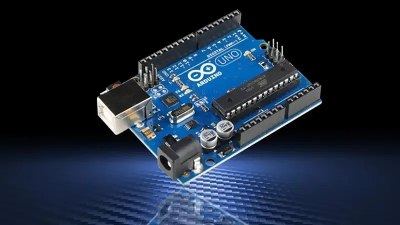

# ⚡ Portfólio de Projetos Arduino

<p align="center">
  
</p>

<p align="center">
  <b>Uma experiência imersiva Maker / Cyberpunk construída com altíssima performance, acessibilidade e zero frameworks.</b>
</p>

---

## 🚀 Sobre o Projeto

Este repositório contém o código-fonte do portfólio de projetos Arduino de **Roberto Átila**, estudante do curso Técnico em Informática para Internet. O projeto foi redesenhado do zero para refletir uma estética *hardcore*, inspirada em terminais, placas de circuito impresso (PCBs) e na IDE clássica do Arduino.

O maior desafio técnico deste projeto foi garantir uma **performance extrema** (simulando 100/100 no Lighthouse), animações fluidas e acessibilidade avançada utilizando apenas **Vanilla Web Technologies** (sem dependências como React, Vue ou bibliotecas de terceiros).

## 🛠 Stack Tecnológica

*A regra de ouro deste projeto é a imutabilidade da stack base:*
- **HTML5 Semântico:** Estrutura otimizada e tags acessíveis (`aria-hidden`, `aria-expanded`).
- **CSS3 Puro:** Variáveis nativas (Design System), animações `@keyframes` complexas, contadores CSS para números de linha e efeitos Neon Glow (Mix-blend-mode / Drop-Shadow).
- **JavaScript ES6+:** Módulos lógicos via closures, `IntersectionObserver`, `requestAnimationFrame`, `Debounce` de eventos e manipulação profunda de DOM/History.
- **Progressive Web App (PWA):** `manifest.json` com ícones vetoriais customizados para instalação mobile e web.
- **Zero Build Steps:** Sem NPM, Node.js, Webpack ou Vite. Roda nativamente direto no navegador.

## ✨ Principais Funcionalidades e Arquitetura

- **Estética Maker/Cyberpunk:** Paleta de cores dark neon (`#0a0e17`, cyan e purple), utilizando fontes modernas (`Chakra Petch`, `DM Sans`, `JetBrains Mono`).
- **Hardware Monitor Real-time (Simulado):** Painel interativo que exibe estatísticas em tempo real da "CPU", "Temperatura" e "Memória" da placa Arduino virtual.
- **Busca Global Instantânea:** Campo de busca com filtro dinâmico que permite encontrar projetos por nome ou componentes instantaneamente.
- **Boot Screen Autêntico:** O site inicia com a icônica logo do infinito do Arduino e renderiza no terminal um log de compilação real (`avr-gcc: compiling...`, `avrdude: uploading...`) antes de revelar o conteúdo.
- **Simulador Interativo Dinâmico:** Um simulador construído em JS que carrega projetos de `data.js`, aplica cores aos LEDs virtuais, e permite controle de velocidade (ms). Inclui um botão para cópia instantânea de código (`Clipboard API`).
- **Syntax Highlighter com Line Numbers:** Formatador de código C++/Arduino feito do zero em JS puro. O código é renderizado no modal simulando uma IDE real com **números de linha nativos (CSS Counters)**.
- **Acessibilidade - Focus Trap Avançado:** O modal de projetos foi desenhado com um sistema de `Focus Trap` em JS, prendendo o foco da tecla `Tab` nos botões internos do modal.
- **Otimização de Renderização (CPU/GPU):** 
  - Animações em Canvas (Chuva Digital e Constelação) contam com `IntersectionObserver` para pausar os cálculos matemáticos quando fora de tela.

## ⚙️ Como Executar Localmente

Como o projeto é livre de dependências, visualizá-lo localmente é tão simples quanto abrir um arquivo:

1. Clone o repositório:
   ```bash
   git clone https://github.com/robertoatila/Portf-lios-de-Projetos-Arduino.git
   ```
2. Abra a pasta do projeto.
3. Dê um duplo-clique no arquivo `index.html`.
4. *Pronto!* A magia acontece direto no seu navegador. *(Nota: Para 100% de suporte às fontes e PWA, recomenda-se abrir via `Live Server` no VS Code).*

## 👨‍💻 Autor

**Roberto Átila Almeida Azevedo**  
Estudante de Técnico em Informática para Internet e apaixonado por embarcados, desenvolvimento web e IoT.

* [LinkedIn](https://www.linkedin.com/in/roberto-%C3%A1tila-almeida-azevedo-0a64412b4/)
* [GitHub](https://github.com/robertoatila)

---
*Construído com código, café e resistores.* ⚡
